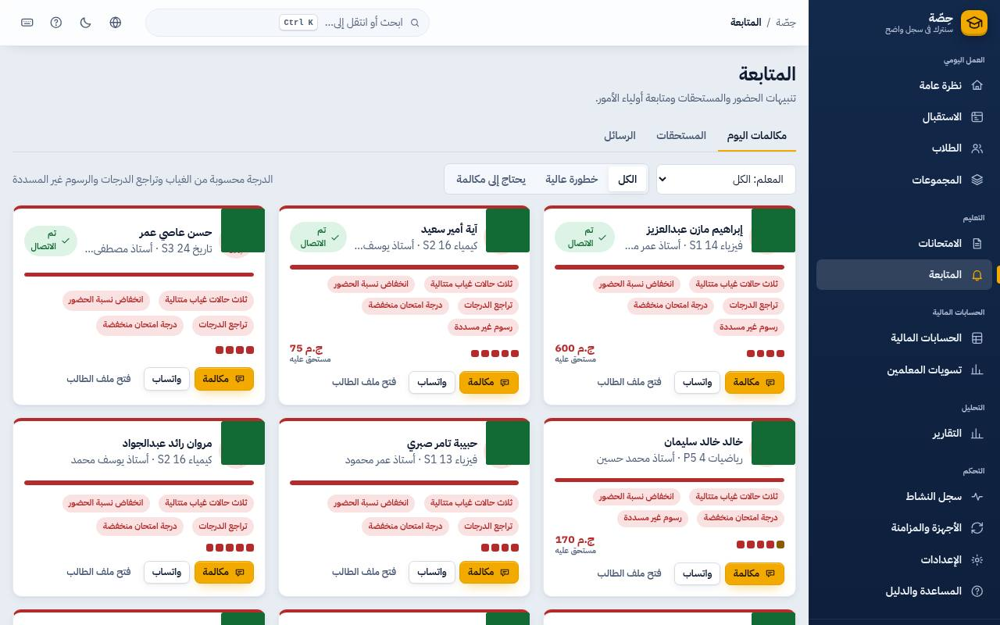

<!-- first-sale-contract: 2026-10-06 -->
> **Owner decision — 6 October 2026:** Read [the first-sale contract](../LAUNCH_SCOPE.md) before using this document. The limited pilot core and its launch gates take priority; extra features belong to later releases or separately accepted add-ons. Existing implementation/history below is preserved and is not a claim of first-sale acceptance.

# دليل المساعد

> شغلك: الكشف، الدرجات، المكالمات والرسايل. الفلوس مش عندك. الأسماء في الصور وهمية.

## الكشف

**الاستقبال** ← تحت «حصص اليوم» اضغط على الحصة ← علّم كل طالب (حاضر / متأخر / غائب / بعذر) أو **تسجيل الجميع حاضرين** ← **حفظ**.
اللي يتمسح كارته عند الباب بيظهر حاضر لوحده. اللي وصل بعد ما اتكتب غائب: يمسح كارته ويتسجل متأخر.

## الدرجات

**الامتحانات** ← افتح الامتحان ← اكتب الدرجات (`Enter` للي بعده، `A` = غائب) أو الصق عمود من إكسل ← **حفظ الدرجات**.
الدرجة الغلط (أكبر من النهائية) بتحمر ومش بتتحفظ.

## المتابعة والمكالمات

**المتابعة ← مكالمات اليوم**: كل كارت فيه السبب (غياب متتالي، نسبة حضور قليلة، درجات نازلة) وآخر 6 حصص.

1. **مكالمة** ← اتصل ← اختار النتيجة (رد، مارد، وعد، هيسيب) واكتب ملاحظة ← **حفظ**.
2. **واتساب**: الرسالة جاهزة؛ اضغط **افتح واتساب**، ابعت من هناك، وارجع اضغط **نعم، أُرسلت**. لو ماتبعتتش اضغط **لم تُرسل**،
   ومش هتتحسب.
3. **الرسائل ← الغياب**: كل غياب النهارده واحد واحد. اللي اتبلغ قبل كده النهارده مش بيتكرر.

## اللي مش مسموحلك (وده عادي)

- التحصيل أو الفلوس.
- تعديل بيانات الطلاب الأساسية أو الخصومات.
