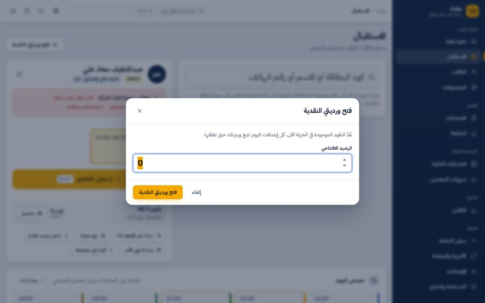
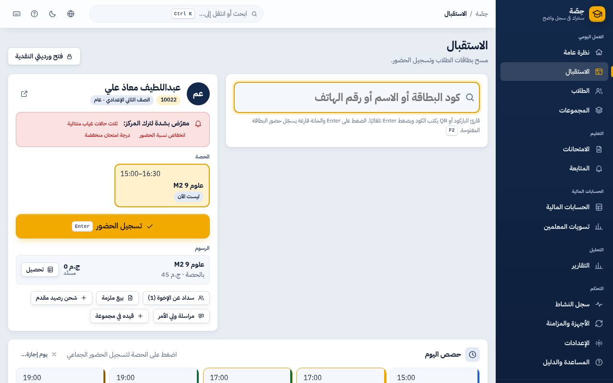
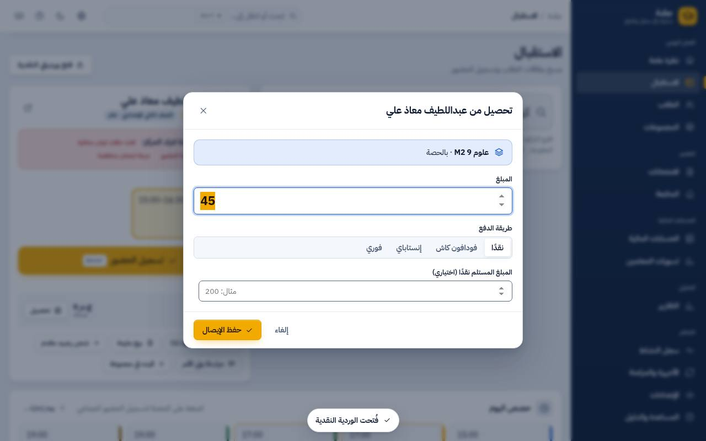
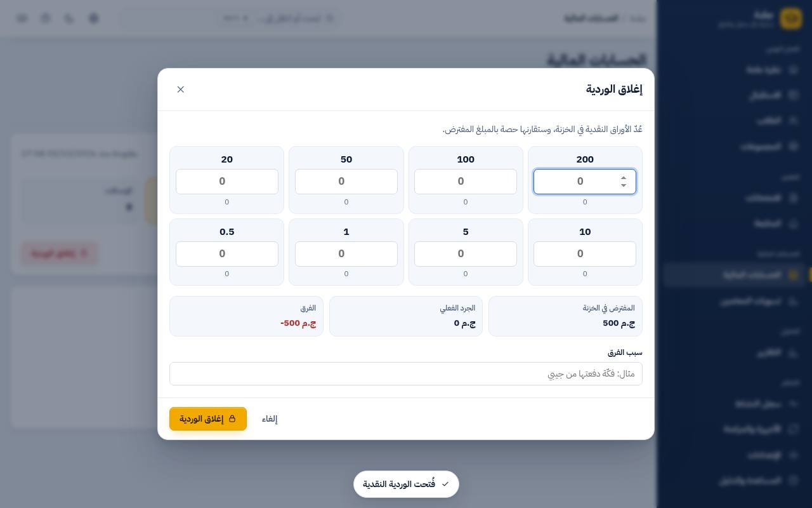
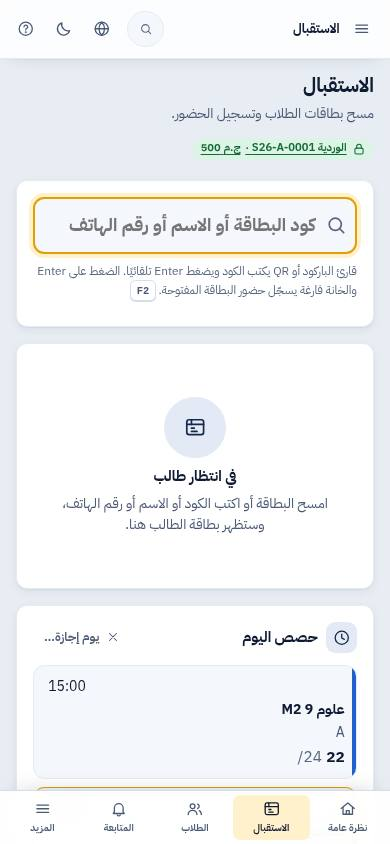

# دليل موظف الاستقبال (الباب)

> صفحة واحدة. اقراها مرة، وارجعلها لما تحتاج. الأسماء في الصور كلها وهمية.

## أول اليوم

1. افتح **الاستقبال** من القايمة (أو اضغط `D`).
2. أول ما تحصّل أول فلوس، البرنامج هيطلب **فتح الوردية النقدية**: اكتب الفلوس اللي في الدرج دلوقتي (الفكة).

## الطالب وصل

- **بالماسح**: امسح الكارت. لو عنده حصة دلوقتي، الحضور بيتسجل لوحده وتسمع صفارة خفيفة.
- **من غير ماسح**: اكتب الكود أو الاسم أو رقم وليّ الأمر واضغط `Enter`.
- لو الطالب اتكتب **غائب** في الكشف ووصل متأخر: امسحه عادي، هيتسجل **متأخر** بوقت وصوله.
- لو مسحته مرتين: البرنامج بيقولك إنه متسجل، **ومابيسجلش مرتين**.

في الكارت هتلاقي:
- **الحصة** المقترحة (حصته دلوقتي). لو جاي يعوّض في مجموعة تانية لنفس المادة، هتلاقيها مكتوب عليها «تعويضية».
- **الرسوم** لكل مجموعة: أحمر = عليه فلوس، أخضر = دافع مقدم.
- لو فيه علامة حمرا «معرّض لترك المركز»: بلّغ المسؤول أو المتابعة.

## التحصيل

1. اضغط **تحصيل** جنب المجموعة. المبلغ المقترح هو اللي عليه.
2. اختار طريقة الدفع. لو فودافون كاش أو إنستاباي: اكتب **رقم العملية**.
3. لو نقدي ووليّ الأمر إداك 200: اكتبها في «المبلغ المستلم» والبرنامج يقولك الباقي.
4. **حفظ الإيصال**. الإيصال يتطبع لو مفعّل الطباعة التلقائية، أو من زرار **طباعة** اللي بيظهر في الكارت.

- **إخوات؟** زرار **سداد عن الإخوة**: دفعة واحدة وإيصال واحد للكل.
- **ملزمة؟** زرار **بيع ملزمة**: اختار الملزمة والعدد. مش هيبيع أكتر من اللي في المخزن.
- **فلوس مقدم؟** زرار **شحن رصيد مقدم**.
- **رقم زيادة بالغلط** (1500 بدل 150)؟ البرنامج بينبهك قبل الحفظ.

## غلطت في إيصال؟

الإيصال **مايتمسحش ولا يتعدل** (ده لحمايتك). المسؤول يعمل **قيد عكسي** للإيصال بسبب مكتوب، وإنت تعمل إيصال جديد صح.

## النت أو الكمبيوتر الرئيسي وقع

هيظهر شريط أحمر فوق: **«انقطع الاتصال بجهاز المركز»**، والزراير بتبهت. **مفيش حاجة بتتحفظ** لحد ما يرجع، والبرنامج مش بيضحك عليك
ويقول اتحفظ. أول ما يرجع، كمّل عادي. لو كنت ضغطت «حفظ» في دفع والرد ماوصلش، دوس حفظ تاني: **مش هيتحصّل مرتين**.

## آخر اليوم: قفل الدرج

1. **الحسابات المالية ← إغلاق الوردية**.
2. عد الفلوس بالفئات (200، 100، 50…) والبرنامج يجمع.
3. لو فيه فرق (زيادة أو عجز) لازم تكتب السبب. ده طبيعي ومش عيب، المهم يتكتب.
4. اطبع تقرير الوردية ووقّع عليه.

## اللي مش مسموحلك (وده عادي)

- تمسح إيصال أو تعدّله.
- تشوف أرباح السنتر أو تسويات المدرسين.
- تغيّر الإعدادات أو الصلاحيات.

## من الموبايل

نفس الشاشة بتشتغل على الموبايل (الشريط اللي تحت فيه الاستقبال والطلاب). الكاميرا بتمسح الكود لو فتحت البرنامج بعنوان آمن (https)؛
لو مش ظاهر زرار الكاميرا، اكتب الكود بإيدك.

