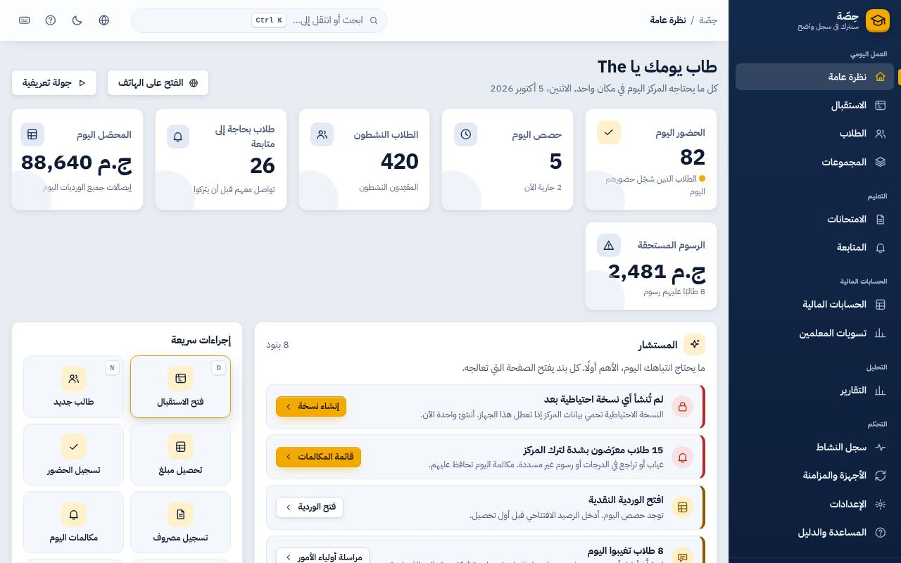
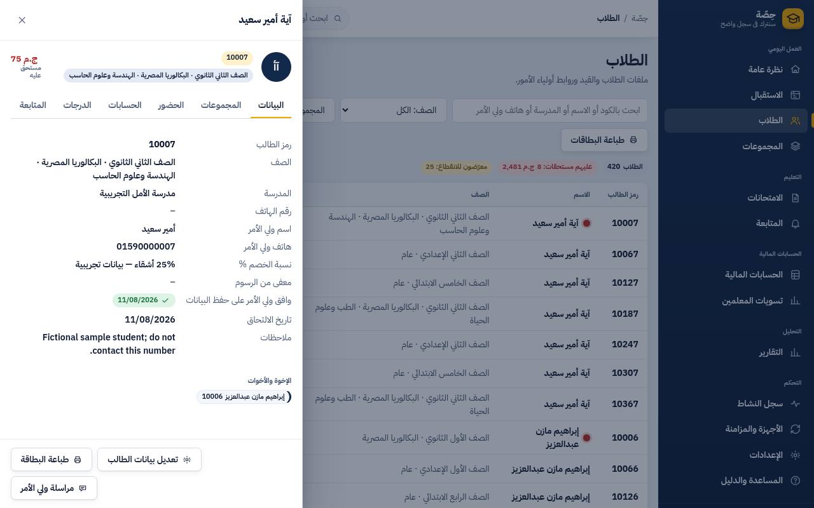
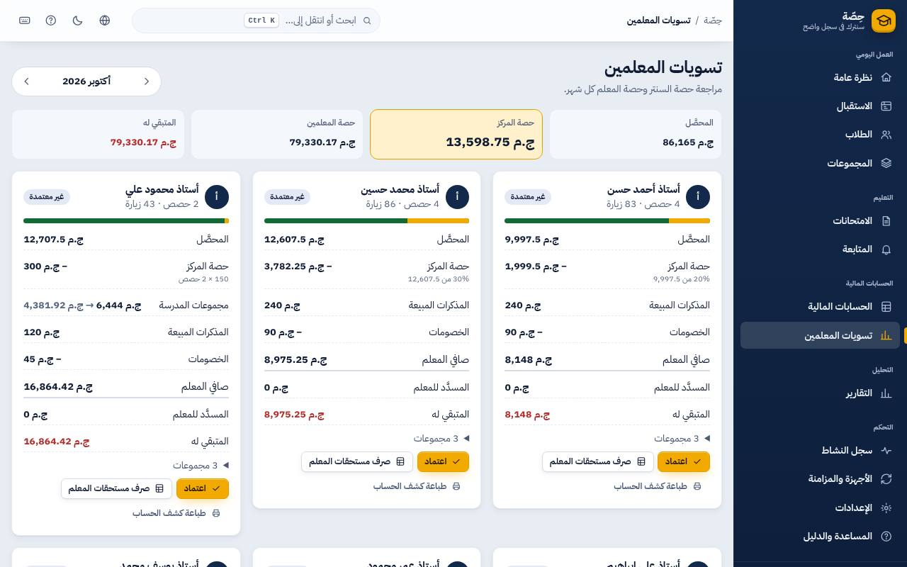
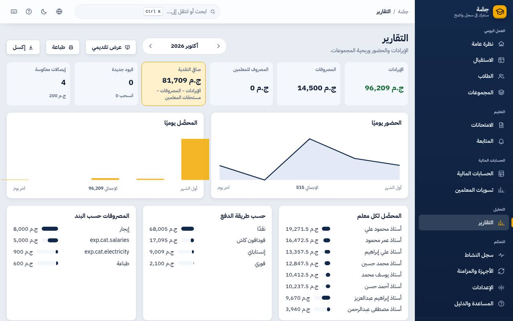
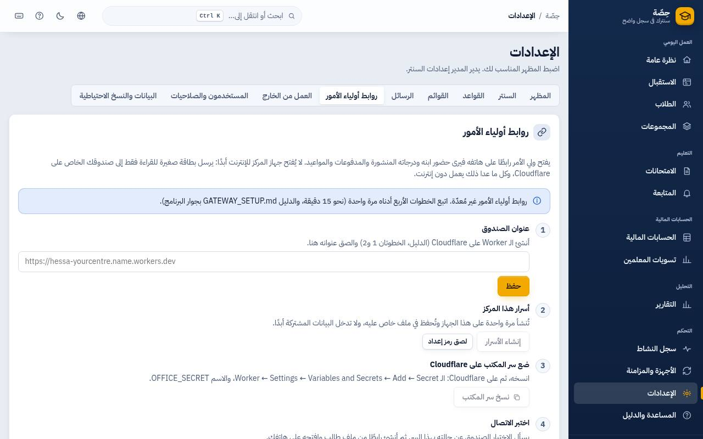
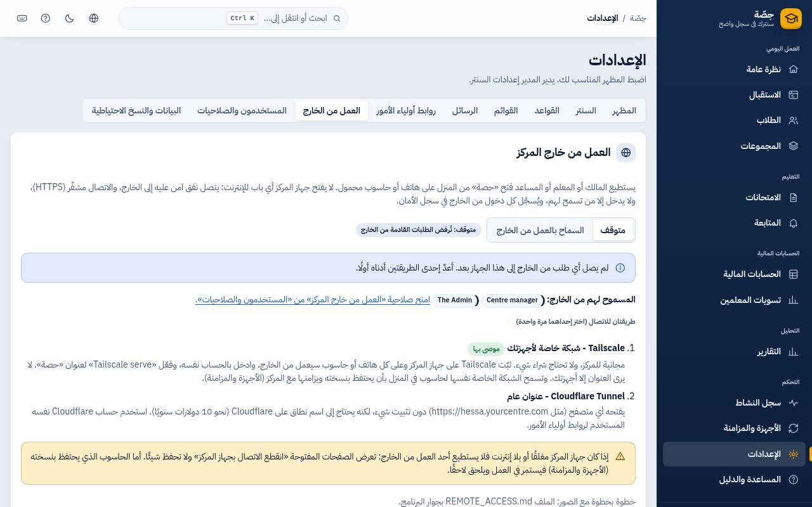

# دليل صاحب السنتر / المدير

> اللي محتاج تعرفه عشان السنتر يمشي، والفلوس تبقى واضحة، والبيانات ماتضيعش. الأسماء في الصور وهمية.

## اليوم في نظرة واحدة

**نظرة عامة** (`O`): حضور النهارده، الحصص الشغالة دلوقتي، المتحصّل، الطلاب اللي محتاجين متابعة، وكارت **«كله تمام؟»**
(النسخ الاحتياطي، الأجهزة، روابط أولياء الأمور). المستشار تحت بيقولك أهم 3 حاجات تعملها النهارده، وكل واحدة ليها زرار.

## أول تجهيز (مرة واحدة)

1. **الإعدادات ← المركز**: اسم السنتر وكلام آخر الإيصال.
2. **الإعدادات ← القوائم**: المواد، القاعات، **المعلمين وشروط كل واحد** (نسبة، إيجار حصة، إيجار طالب، شهري، أو خليط). البرنامج بيكتبلك
   مثال بالأرقام عشان تتأكد إن الشرط صح.
3. **المجموعات**: المعاد والقاعة والرسوم. البرنامج **بيرفض** قاعة أو معلم في مكانين في نفس الوقت.
4. **الطلاب ← استيراد**: ملف إكسل أو CSV، بتشوفه قبل الحفظ وتصلّح فيه، والأرقام العربي بتتظبط لوحدها.
5. **الإعدادات ← المستخدمون والصلاحيات**: حساب لكل حد. المعلم تقدر تقصره على **مجموعاته هو بس**.

> عايز تجرب الأول؟ **سنتر المثال** من النظرة العامة، وبعدين **الإعدادات ← البيانات ← حذف بيانات المثال** (بياناتك الحقيقية مابتتلمسش).

## الطالب

اضغط على أي طالب: ملفه كله في مكان واحد (البيانات، المجموعات، الحضور، الفلوس، الدرجات والترتيب، المتابعة، **رابط وليّ الأمر**، والسجل).

- **نقل** لمجموعة تانية: الفلوس المدفوعة مقدم بتنتقل لو نفس المعلم، وإلا بتفضل في المجموعة القديمة لحد ما ترجّعها.
- **خصم أو إعفاء**: محتاج صلاحية الخصومات.
- الطالب اللي ساب وعليه فلوس **بيفضل ظاهر** في المستحقات بعلامة «ساب».

## الفلوس

- كل إيصال **مايتمسحش**. الغلط بيتصلح بـ **قيد عكسي** بسبب مكتوب (الحسابات المالية ← الإيصالات).
- **الورديات**: تشوف ورديات كل الموظفين، وأي فرق وسببه.
- **المصروفات**: إيجار، كهربا، طباعة، ودفعات المدرسين.
- مفيش «رصيد» متخزن في أي حتة: الرصيد دايمًا محسوب من الحضور والإيصالات، فمستحيل يتلعب فيه.

## تسويات المعلمين

**تسويات المعلمين** (`T`): لكل معلم كارت بالمتحصّل ونصيب السنتر **بالمعادلة مكتوبة بالكلام**، والملازم، والخصومات، والصافي،
والمدفوع والباقي. **اعتماد** بيثبّت الشهر (ولو البيانات اتغيرت بعد الاعتماد بيقولك الفرق). **صرف مستحقات المعلم** بيعمل مصروف. **طباعة** كشف بتوقيعين.

## التقارير

الشهر: دخل، مصروفات، صافي، حضور يومي، تحصيل يومي، **ربحية كل مجموعة** مع قرار واضح (افتح مجموعة تانية / ادمج / راقب / خسرانة)،
وفروق الدرج. زرار **عرض** للاجتماع، و**طباعة**، و**إكسل** (8 صفحات).

مجموعات التقوية في المدرسة: من لوحة المجموعة ← **كشف المدرسة** (الخزانة 15% ثم نصيب المعلم ثم المدرسة)، للطباعة أو إكسل.

## روابط أولياء الأمور

وليّ الأمر بيفتح رابط على موبايله ويشوف ابنه بس: المواعيد، الحضور، الدرجات **اللي المعلم نشرها**، والمدفوعات. التجهيز مرة واحدة:
**الإعدادات ← روابط أولياء الأمور** (4 خطوات، والدليل `GATEWAY_SETUP.md`).

ولو معلم عايز صفحة على النت فيها مجموعاته والأماكن الفاضية وزرار حجز بواتساب: اكتب **اسم الصفحة** في ملفه (التفاصيل في `GATEWAY_SETUP.md`).

## الشغل من البيت

**الإعدادات ← العمل من الخارج**: مقفول لحد ما تفتحه من السنتر، ومحدش يدخل غير اللي إديته الصلاحية. الدليل `REMOTE_ACCESS.md`.

## بياناتك ماتضيعش

- نسخة احتياطية أوتوماتيك كل يوم، وتقدر تضيف **فولدر تاني على فلاشة أو هارد تاني** (الإعدادات ← البيانات).
- **افحص بياناتي دلوقتي** بيتأكد إن كل حاجة سليمة.
- أي حاجة اتمسحت بتروح **سلة المحذوفات** وترجع بضغطة.
- كل تعديل متسجل: مين، إمتى، من أنهي جهاز، وكان إيه وبقى إيه (**سجل النشاط**)، وتقدر تعمل **التراجع عن هذا التغيير**.
- كذا جهاز في السنتر؟ **الأجهزة والمزامنة**: كل جهاز معاه نسخة كاملة ويشتغل لوحده لو الشبكة وقعت.
