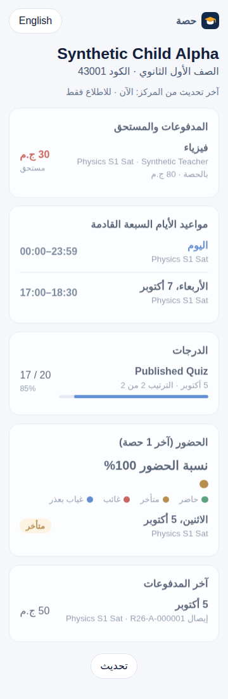

# رابط وليّ الأمر — إيه اللي هتشوفه

> الصفحة دي تتبعت لوليّ الأمر أو تتطبع وتتعلق في السنتر.

السنتر بيبعتلك **رابط خاص بابنك** على واتساب. افتحه من أي موبايل، من غير برنامج ومن غير باسورد.

## هتلاقي

- **المدفوعات والمستحق** لكل مادة، والحصص المتبقية لو باقة.
- **مواعيد الأيام السبعة الجاية** زي ما هي فعلاً (حتى لو المواعيد اتغيرت في رمضان).
- **الدرجات** اللي المدرس نشرها، وترتيب ابنك («الترتيب 3 من 42»).
- **الحضور** آخر 30 حصة بالألوان: أخضر حاضر، أصفر متأخر، أحمر غائب، أزرق بعذر.
- **آخر المدفوعات** بأرقام الإيصالات.

## مهم تعرفه

- الصفحة **للاطلاع بس**، مفيش فيها أي زرار يغيّر حاجة.
- مفيها **أي رقم تليفون**، ولا بيانات أي طالب تاني.
- لو فتحتها من غير نت، بتظهر **آخر نسخة** على موبايلك ومكتوب إنها ممكن تكون قديمة.
- اللغة عربي، وفيه زرار **English**. الشكل فاتح أو داكن على حسب موبايلك.
- الرابط زي المفتاح: **ماتبعتوش لحد**. لو وصل لحد غلط، اطلب من السنتر **رابط جديد**؛ القديم بيقف فورًا ويتمسح من أي موبايل كان فاتحه.
