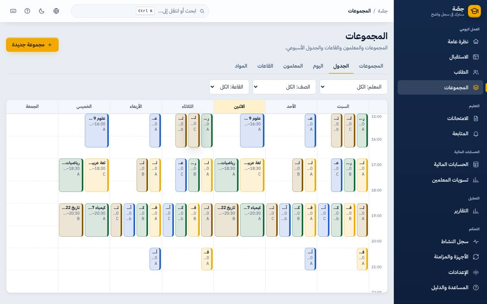
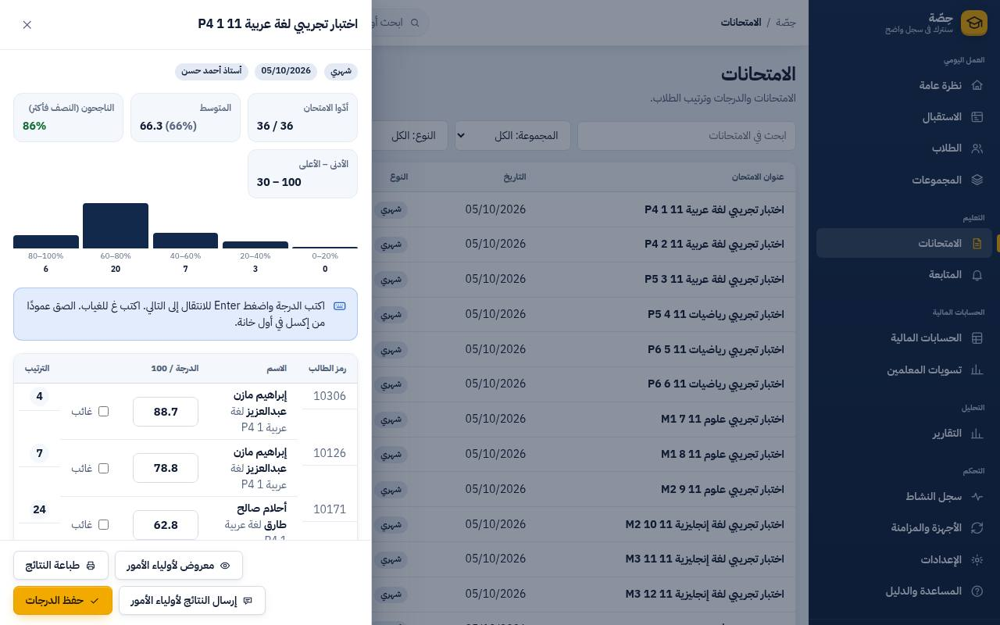

<!-- first-sale-contract: 2026-10-06 -->
> **Owner decision — 6 October 2026:** Read [the first-sale contract](../LAUNCH_SCOPE.md) before using this document. The limited pilot core and its launch gates take priority; extra features belong to later releases or separately accepted add-ons. Existing implementation/history below is preserved and is not a claim of first-sale acceptance.

# دليل المعلم

> حسابك بيشوف **مجموعاتك وطلابك بس**، ونصيبك في التسوية. الأسماء في الصور وهمية.

## مواعيدك

**المجموعات ← الجدول**: الأسبوع كله بألوان المعلمين. على الموبايل بيظهر يوم بيوم.

- **حصة زيادة** (تعويض يوم إجازة أو مراجعة قبل امتحان): من لوحة المجموعة ← **حصة إضافية**. البرنامج بيرفض لو القاعة أو إنت مشغولين.
- **يوم إجازة** (عيد، الكهربا قطعت): زرار **يوم إجازة…** من الاستقبال أو المجموعات، بيلغي كل حصص اليوم مرة واحدة.

## الكشف (الحضور)

من الاستقبال أو المجموعة: اضغط على الحصة ← الكشف. كل طالب: حاضر / متأخر / غائب / بعذر، و**تسجيل الجميع حاضرين** بضغطة. الطالب اللي
اتكتب غائب ووصل بعدين بيمسح كارته عند الباب ويتسجل متأخر.

## الامتحانات والدرجات

1. **الامتحانات ← امتحان جديد**: العنوان، النوع، الدرجة النهائية، والمجموعات.
2. افتح الامتحان: اكتب الدرجات، `Enter` ينزل للي بعده، `A` = غائب. أو **الصق عمود من إكسل** مرة واحدة.
3. الترتيب بيتحسب لوحده (اللي متساويين ليهم نفس الترتيب).
4. **مهم**: الدرجات **مش بتوصل لأولياء الأمور** وهي «مخفي عن أولياء الأمور». خلّص الرصد، واضغط الزرار يبقى **معروض لأولياء الأمور**.

- **إرسال النتايج**: واتساب واحد واحد من رقم السنتر (مش جماعي عشان الرقم مايتقفلش). بعد ما تبعت، البرنامج يسألك «اتبعتت؟».
- **طباعة** كشف النتايج للوحة.

### بنك الأسئلة
- **الامتحانات ← بنك الأسئلة ← سؤال جديد**: اكتب السؤال والاختيارات (من 2 لـ 5) وعلّم على الصح، وممكن تكتب شرح يطلع في نموذج الإجابة.
- في الامتحان: **أضف من بنك الأسئلة** واختار. عدد الأسئلة ونموذج الإجابة بيتملوا لوحدهم، وتقدر ترتّب الأسئلة بالأسهم.
- الامتحان بيحتفظ بنسخته: لو عدّلت سؤال في البنك بعدين، الامتحان مش بيتغير لوحده؛ هيظهرلك «تغيّر في البنك» وإنت تختار «استخدم النسخة الجديدة».
  لو فيه درجات متسجلة، البرنامج يسألك الأول، والدرجات القديمة ما بتتغيرش.
- **طباعة الأسئلة**: ورقة الأسئلة للطلبة، و**نموذج الإجابة** بالشرح ليك.
- **توليد بالذكاء الاصطناعي** (لو المدير فعّله): اختار المادة والصف واكتب الدرس، وهيطلعلك أسئلة. اقرا كل سؤال: **إضافة إلى البنك** أو **تصحيح** أو **استبعاد**. مفيش حاجة بتدخل البنك من غيرك.

## المتابعة

**المتابعة**: الطلاب اللي في خطر يسيبوا (غياب متكرر، درجات نازلة، فلوس متأخرة)، مع السبب. **مكالمة** ← اكتب النتيجة. المتابعة
بتنزّل درجة الخطر أسبوعين.

## تسويتك

**تسويات المعلمين**: كارتك بالمتحصّل ونصيب السنتر **بالمعادلة مكتوبة**، وصافيك والمدفوع والباقي.

## اللي مش مسموحلك (وده عادي)

- تشوف طلاب أو فلوس معلم تاني.
- تمسح إيصال أو تغيّر شروط التسوية.
